# Simplifying Web Development with Accessibility Best Practices

- Morten Rand-Hendrickson

---

## Back to the Basics

- Complexity Obscures Simplicity

  - Many ways of doing things makes things confusing

- Accessibility is the core promise of the web

- Don’t use divs as buttons


- use a button instead

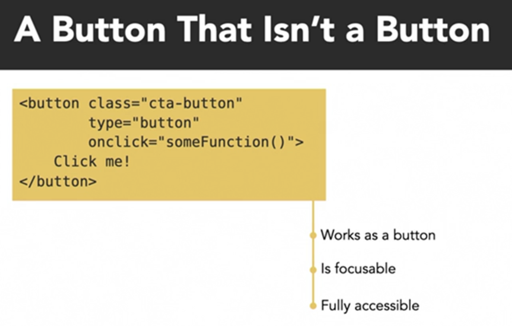

- Many of our habits, examples, and best practices rely on building custom solutions to problems the web platform has already solved with standard-based elements
- When something is not accesible on the web, it is because something has gone wrong in its development. Accessibility problems are designed and built in by us.
- Accessibility is the Job.
- What causes accessibility problems?

  - Lack of awareness
    - Accessibility was long considered an optional feature
    - Historical lack of available education and best practice examples
    - accessibility awareness and education is improving
  - Problems introduced through iteration.

- Accessibility Mindset
  - What is the functionality of the thing I’m trying to build
  - What existing elements serve this functionality

## Accessible Design

### Accessible Color palette

- Designing an accesible color palette for your project centers on two core principles

  - Color Contrast

    - WCAG recommendations
      - background to text color contrast ratios:
        - Small Text (23px or less): 4.5
        - Small bold text (17px or less): 4.5
        - Large text (24px or more): 3
    - [webaim](https://webaim.org) to check contrast
    - [Create accessible palette](https://color.adobe.com)

  - Color Blindness
    - 8% of male global population is red-green color blind
    - don’t rely on color difference only when indicating state

### Accessible typography

- What does it mean? Presenting text that has:

  - Enough contrast to the background
  - It is big enough to read
  - It is using a font that is easily readable.

- Accessible Typography Principles
  - Larger font sizes (Within reason) are preferred.
    - Default size of 16px is OK
    - 18ox or 20ox is better
  - avoid complex fonts for anything but decoration
    - handwriting and decorative fonts look good, but are difficult to read
  - avoid “fancy” fonts with unusual features
    - stylish ligaments are difficult to read
  - keep max sentence length between 70 and 80 characters
    - max-width: 70ch;

---

### Designing accessible content hierarchies and flows

- Websites are communication tools
- Websites often display a lot of information.
- our design should accommodate to visualization patterns (example of the typical patters of people reading from left to right)

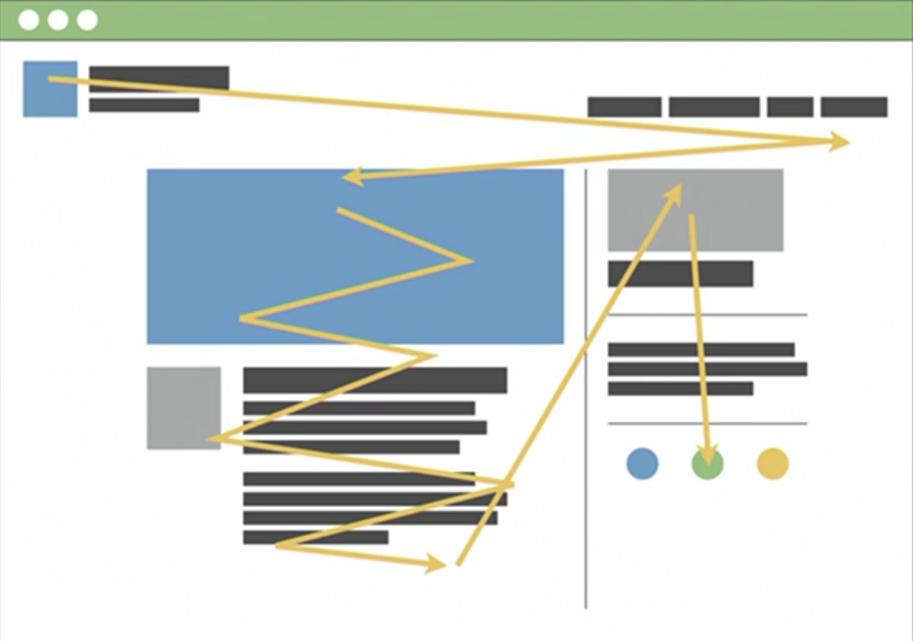

- Scanning Patters

  - Stop at headings and other “breaking” elements.
  - Scan past blocks of text.
  - Note heading hierarchies.
  - Sidebar blindness.

- People tend to ignore what is in the right sidebar (Usually ads are located that way)
- HTML is built for hierarchical content.

---

## 3. Hiding and Showing

### Is hiding or showing content a good idea?

- Web is a visual medium, that’s why we have Web Design

  - Part of this sometimes includes hiding text content from the visual browser

- Ideal scenario

  - Visual browser shows only buttons
  - Screen reader reads out hidden text
  - Search Engines index hidden text and links

- Social Media Links Accessibility
  - make the social media menu a List
  - Add the social media icons and accompanying text
  - And then use CSS, to hide the text from the Visual Browser

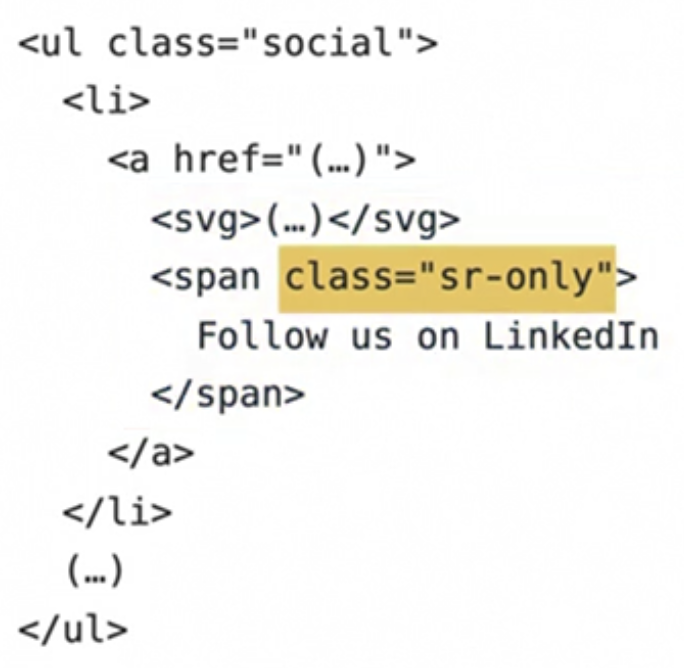

- Separation between text and Links
  - Add a hidden heading inside the Navigation telling the user they are switching context

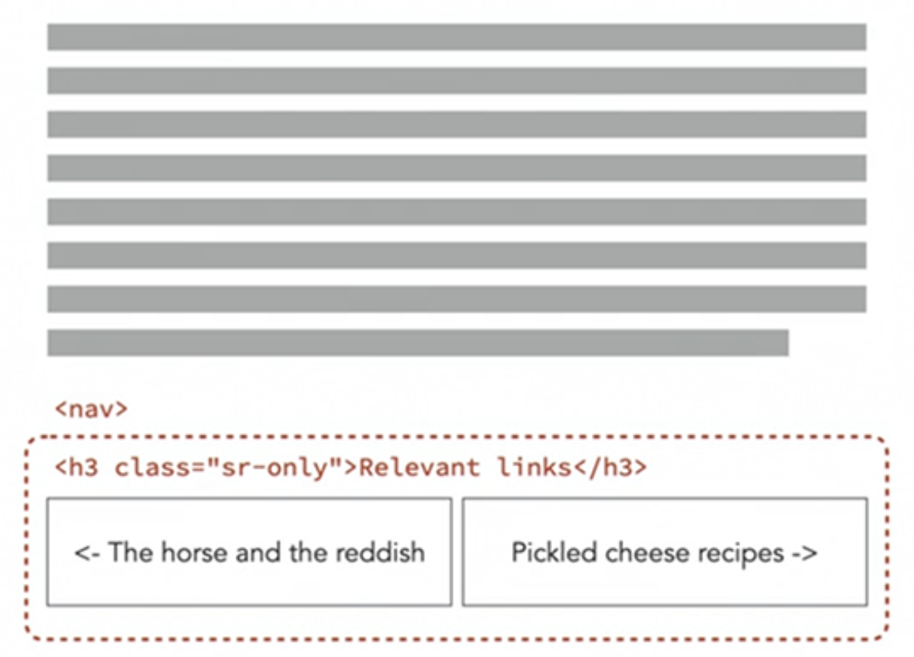

### How to hide visual content

- Content hidden from the visual browser without being hidden from screen readers.
- Screen readers read out what’s visible on the screen. If something is set to display: none; or otherwise hidden, screen reader will not read this content.
- Setting opacity to zero doesn’t work, the elements is still taking space, and if you set the height and width to zero, probably the screen reader will not read it as well
- With the following code, the elements stills exists but it is effectively hidden from the screen and still readable by screen readers.

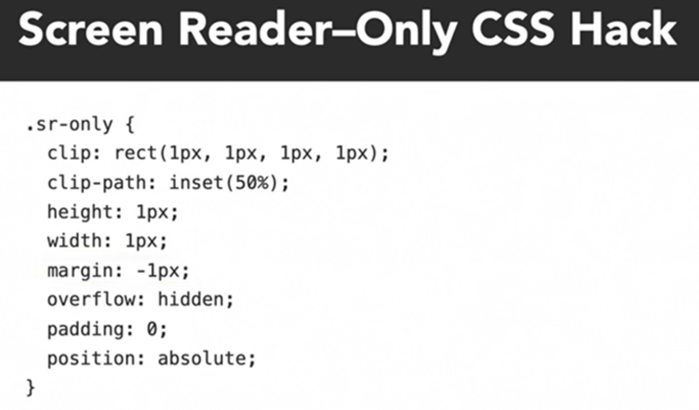

### How to hide content from screen readers

- In cases where visually makes sense to have two links to the same address (like title and button of a card), but it doesn’t makes sense to leave two links for screen readers.
- The aíra-hidden=“true’ attribute hides it and any child elements.


—--

## 4. Semantics and Interactivity

### The role of semantic elements

- With HTML5, now we have highly semantic elements.
  - HTML semantic elements help describe different types of content.
  - Semantic elements have implicit roles describing their role in the document.

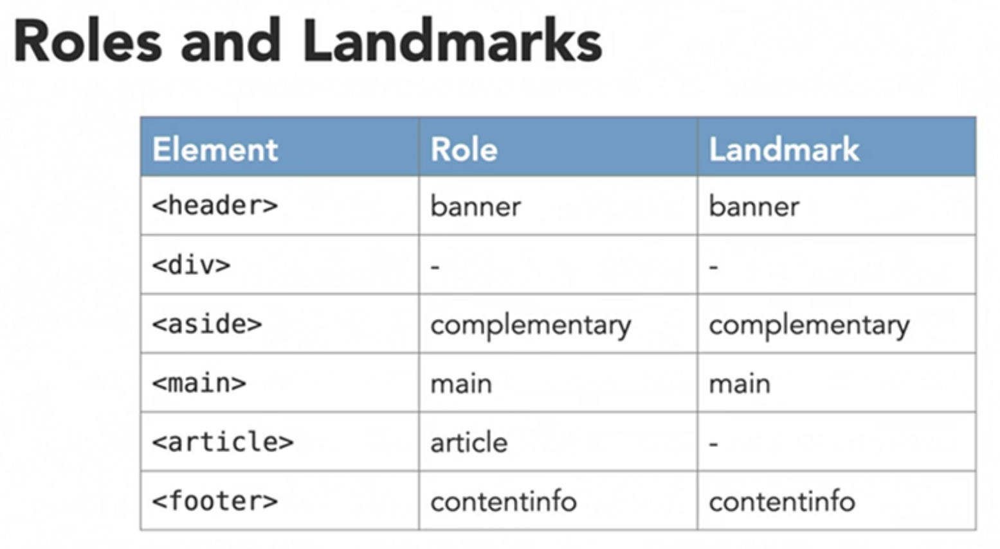

- These roles and landmarks also improve the SEO

### Elements with purpose

- <nav> is for navigation
- <table> is for tables
- <form> is for forms
- <ul> and <lo> are for unordered and ordered lists
- <select> is for selecting things
- <input> is for input elements like check box, date picker, color selector, a password, or range selector.
- <button>
- <link>

- For almost any type of data or interaction, there is a dedicated HTML element.
- That includes not-so-commonly used features like sliding range selectors, and so on.
- Modern browsers have built-in date pickers
- First identify the purpose of the thing you are developing and see if there is an existing HTML element that already serves that purpose.
  - What is the functionality of the thing I’m trying to build?
  - What existing elements serve this functionality?

### Links and button basics

- Both links and buttons have various states with corresponding CSS pseudo classes.

  - :hover
    - The user hovers a pointing device (usually a mouse) over the item
  - :active
    - The item is activated by the user clicking or selecting it
  - :focus
    - The element currently has focus (is selected)
  - :ficus-visible
    - The element has focus and should be visibly focused

- Links have some exclusive pseudo classes

  - :link
    - The link target has not yet been visited
  - :visited
    - The link target has been visited
  - :local-link
    - The absolute URL of the current page and link target match

- We often choose between a link and a button based on their looks
- We should choose based on their function (We can be using the wrong tool for the wrong job)
- How do we decide if it should be a link or a button?
  - Is it a Navigation link taking the visitor to a new location in the document or a new document? --> LINK
  - Is it an interactive element triggering some form of behaviour in the existing context like opening a modal, or closing a modal, or sending a form, or toggling a menu or something similar that doesnt involve navigation? --> BUTTON


### Links

- in its most basic configuration a link is an anchor tag with an href attribute containing the target URL
- We can expand its functionality using URL schemes:
 
  - Phone capabilities
  ```html
  <a href=“tel:+15558675309”>Call our Store</a>
  ```  
  
  - mail to capabilities
  ```html
  <a href=“mailto:store@example.com”>Mail us</a>
  ``` 

  - download capabilities
  ```html
  <a href=“/cheese-menu.pdf” download>See our Menu</a>
  ``` 

- Anytime you have a link, the screen reader will try to read out everything that sits inside the link.


### Buttons

- it doesn’t have default behavior
- Button behavior is added by hooking them to browser events or using JavaScript
- Links are often used in place of buttons (wrong)
- The following code removes all default styling of a button except for the focus state


INSERT CODE

- Best practice
  - Create global styles for all buttons to match design
  - Use classes to apply custom styles where necessary
  - Modify and build on default styling rather than full reset


### Screen reader-friendly links and buttons

- Examples of when hide content from visual browsers and provide more context for screen readers

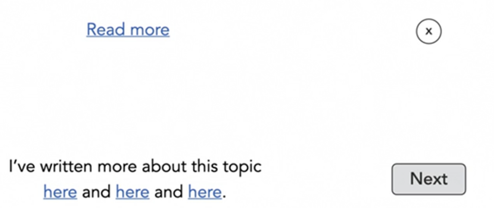 
 
  - Read more links
  - Close modal buttons
  - Next and previous buttons
  - Blocks of texts with links inside


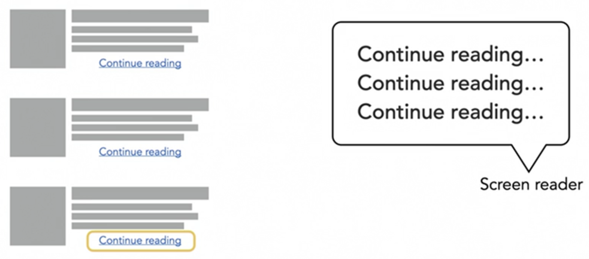

- To fix it, add hidden text

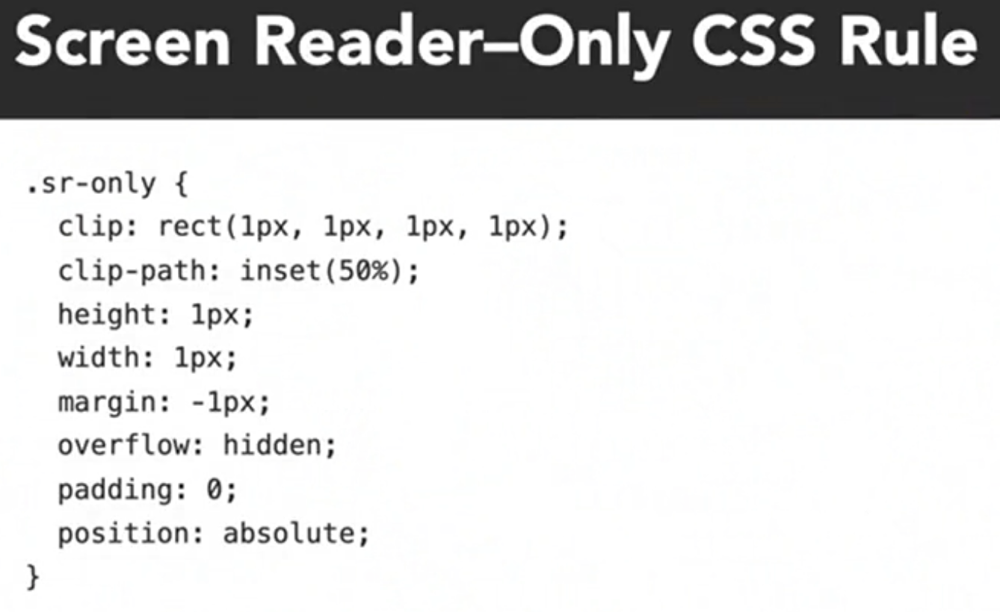

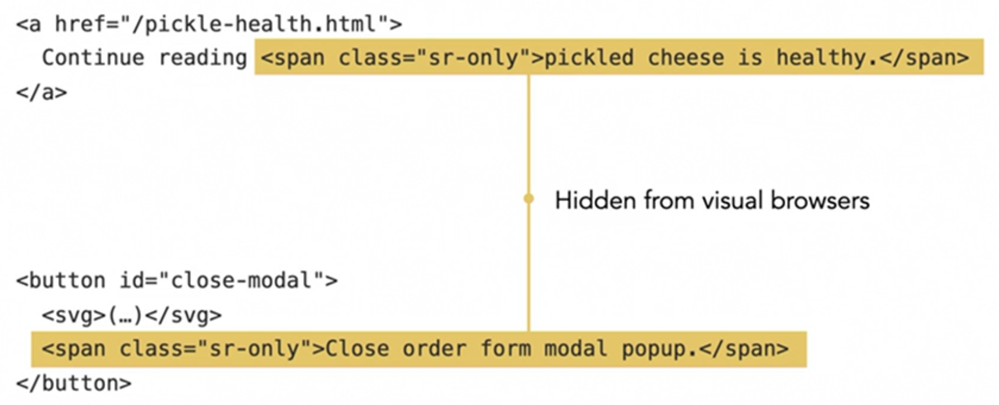


### Icon links and buttons with SVG

- when we want to display a link or a button using an icon with or without accompanying text
- Use SVGs for icons. They can be made accesible, and they don’t interfere with assistive technologies the way icon fonts do.

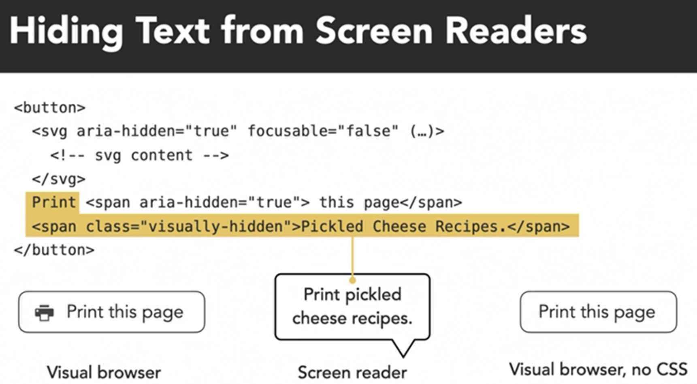

—--

## 5. Images, graphics and media

##w images, graphics and media basics

- two categories
  - Static Assets (images and graphics)
  - Dynamic Assets (Video and Audio)

- Static Assets
  - information
  - link/button
  - decoration

  - defining the purpose of the assets becomes important when choosing how to markup


- Dynamic Assets
  - information
  - decoration (not recommended)

- video and audio are not always accesible
- they require alternative methods for communicating the information within (plain text transcripts)

- advantages for video and audio transcripts
  - make information accesible to anyone through text
  - make information searchable, copyable, and auto-translatable
  - make information indexable for search engines


### the img element

- inline replaced element
- two required attributes
  - src
  - alt
- optional attributes
  - width
  - height
  - loading
  - sizes
  - srcset

-  global CSS reset


INSERT CODE

- Don’t use title attribute (useless)
 
- [alt decisión tree from w3c](https://www.w3.org/WAI/tutorials/images/decision-tree/)
 
- the role of the image can be changed with ARIA roles

 
 
        


